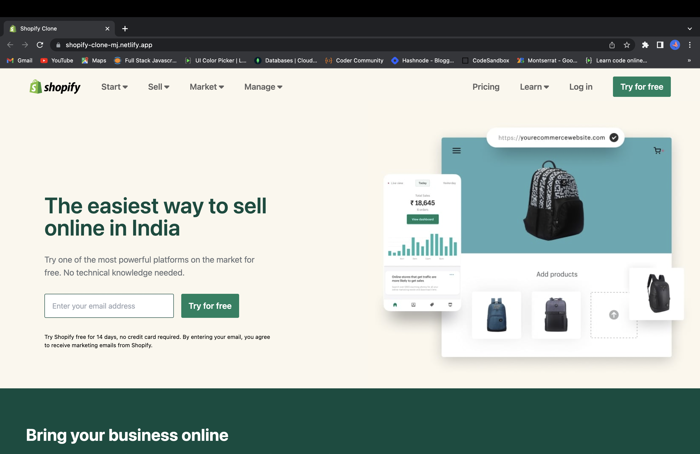
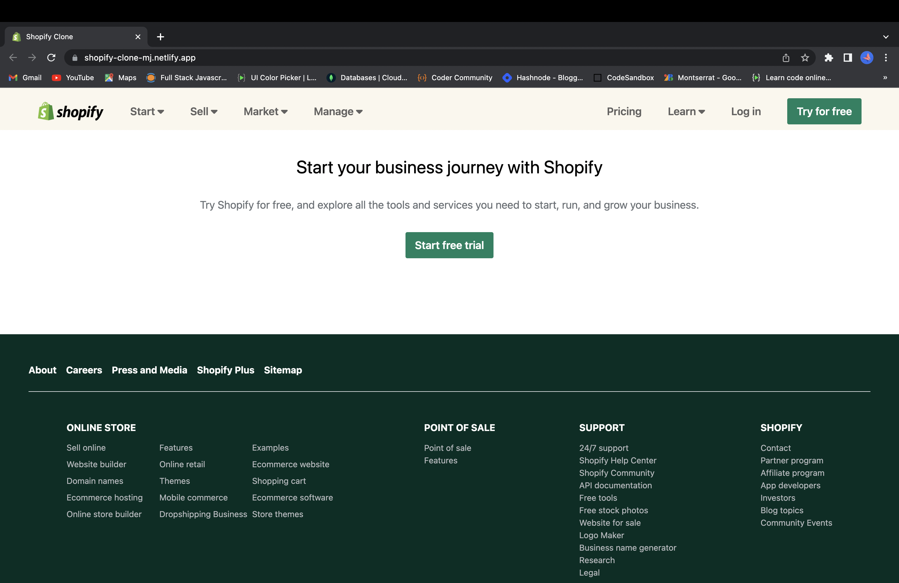

## PROJECT HEADING

# Hello, I'm Mrudul Janbandhu
- - -
It's a Frontend Web Development Project using HTML and Tailwind-CSS. I made it fully responsive.
- - -

# Webpage

- - -

- While developing this webpage, I became more familiar with Tailwind-CSS.

- It took around 8 hr to finish this project.